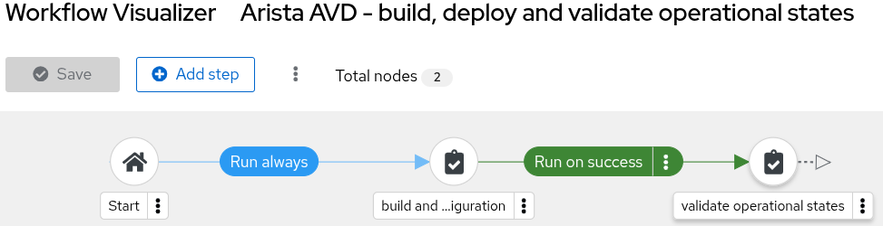
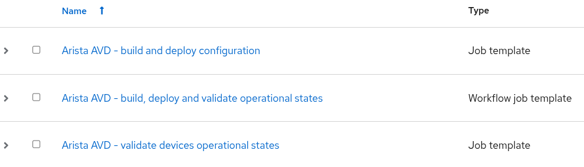
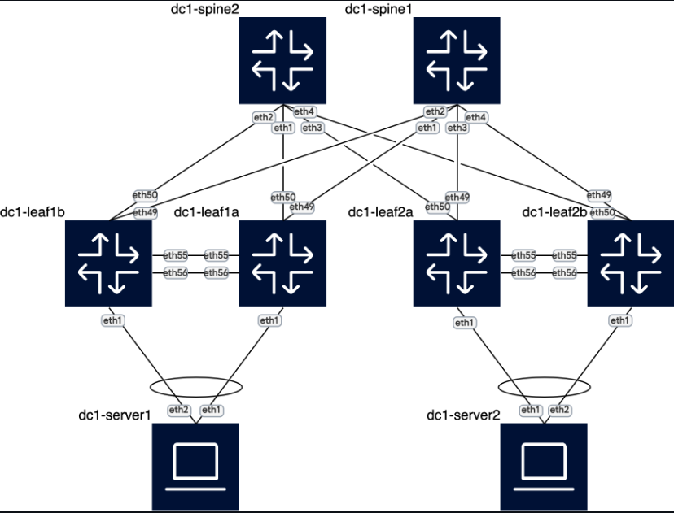

# Arista Validated Designs with Ansible Automation Platform
This repository is a forked and modified version of the [Arista Netdevops Community AVD-AAP project](https://github.com/arista-netdevops-community/avd-aap).

## Overview

This project implements an automated network infrastructure management workflow using Arista Validated Designs (AVD) and Ansible Automation Platform (AAP). The solution provides a basic example of end-to-end automation for network configuration management, deployment and validation.
In this example AAP deploys configurations directly to network devices via eAPI. The same solution can be applied when CloudVision is used for configuration deployment. In both cases the main benefit is introducing the Infrastructure as Code approach with powerful, enterprise-class AAP automation features.

## Key Features

- **Configuration as Code**: Complete network and AAP configuration defined in code
- **Git-based Workflow**: Version-controlled configuration management
- **Documentation Generation**: Automatic network documentation creation
- **Automated Testing**: Built-in validation using ANTA framework  
- **Containerized Lab**: Easy-to-deploy test environment

## Automation Workflow

The solution implements the following Git-based workflow:

### 1. Local Development Environment (VS Code or similar)
- pull repo to get the latest version from GitHub
- modify Source of Truth (SoT) configuration variables in `group_vars/` folder
- stage, commit, and push changes to GitHub

### 2. GitHub & Ansible Automation Platform
Upon push events GitHub Actions trigger the AAP Automation Workflow: **"Arista AVD - build, deploy and validate operational states"**

#### Job 1: Arista AVD - Build and Deploy Configuration
- Pulls repository from GitHub to Execution Environment (EE)
- Generates device configurations and documentation using AVD
- Deploys configurations directly to network devices via eAPI
- Pushes generated artifacts back to GitHub

#### Job 2: Arista AVD - Validate Operational States  
- Pulls repository from GitHub to Execution Environment (EE)
- Validates network operational state using [Arista Network Test Automation (ANTA)](https://anta.arista.com/) framework
- Pushes validation results to GitHub

## AAP Configuration

The complete AAP configuration maintained using Configuration as Code (CaC) approach is available here:
[AAP Configuration as Code Repository](https://github.com/mzdyb/aap-configuration-as-code)

## Network Topology

The solution uses data center fabric topology presented below:

## Related Resources

- [Arista AVD Documentation](https://avd.arista.com/)
- [Ansible Automation Platform](https://www.redhat.com/en/technologies/management/ansible)
- [Containerlab Documentation](https://containerlab.dev/)
- [ANTA Testing Framework](https://anta.arista.com/)

## Author

[@mzdyb](https://www.linkedin.com/in/michal-zdyb-9aa4046/)